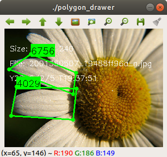
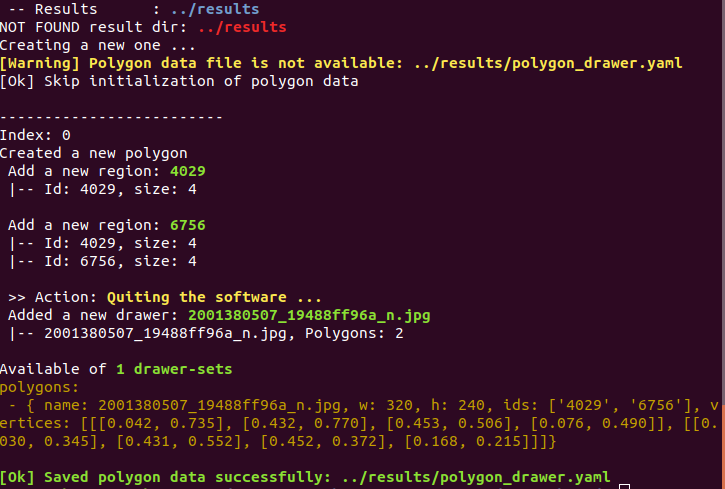

# label_tools_polygon_drawer
- Firstly, build the project.
  ```
  $ mkdir build && cd build
  $ cmake ..
  $ make
  ```
- Assign the input and output directories by editing the file `config/polygon_drawer.yaml`
  ```
  source_image_dir: "/media/flower_photos/daisy"
  results_dir: "../results"
  ```
- Run the executable file
  ```
  $ cd build
  $ ./polygon_drawer
  ```
  
- Press key `a` to add a new polygon to the image
- Drag a corner of a polygon to reshape it
- Press key `ESC` to quit and save the polygon data
  
- Output file `polygon_drawer.yaml` located inside output directory (specified previously in `config/polygon_drawer.yaml`) contains the following data format:
  ```
  appname: ./polygon_drawer

  datetime: Y2022-2-5_T19-39-14

  polygons:
   - { name: 2001380507_19488ff96a_n.jpg, w: 320, h: 240, ids: ['4029', '6756'], vertices: [[[0.042, 0.735], [0.432, 0.770], [0.453, 0.506], [0.076, 0.490]], [[0.030, 0.345], [0.431, 0.552], [0.452, 0.372], [0.168, 0.215]]]}
  ```
